# Air Quality Index (AQI) Prediction for India Using Machine Learning

## Research Project Report

---

## Table of Contents

1. [Project Overview](#1-project-overview)
2. [Project Plan & Status](#2-project-plan--status)
3. [Data Source & Extraction](#3-data-source--extraction)
4. [Exploratory Data Analysis (EDA)](#4-exploratory-data-analysis-eda)
5. [Data Cleaning & Preprocessing](#5-data-cleaning--preprocessing)
6. [Feature Engineering](#6-feature-engineering)
7. [Data Splitting Strategy](#7-data-splitting-strategy)
8. [Regression Models (AQI Value Prediction)](#8-regression-models-aqi-value-prediction)
9. [Classification Models (AQI Category Prediction)](#9-classification-models-aqi-category-prediction)
10. [Deep Learning Models (Time-Series)](#10-deep-learning-models-time-series)
11. [Hyperparameter Tuning (Optuna)](#11-hyperparameter-tuning-optuna)
12. [SHAP Explainability Analysis](#12-shap-explainability-analysis)
13. [Real-Time Prediction & Web Panel](#13-real-time-prediction--web-panel)
14. [Key Findings & Analysis](#14-key-findings--analysis)
15. [Project Structure](#15-project-structure)
16. [Reproducibility](#16-reproducibility)
17. [AQI Forecasting & Insights](#17-aqi-forecasting--insights)

---

## 1. Project Overview

### Objective

Build machine learning models to predict India's **Air Quality Index (AQI)** using pollutant concentration data from the Central Pollution Control Board (CPCB). The project addresses two prediction tasks:

1. **Regression**: Predict the exact AQI value (continuous)
2. **Classification**: Predict the AQI category (Good, Satisfactory, Moderate, Poor, Very Poor, Severe)

### AQI Standard Used: CPCB (India)

India's AQI is computed using the **CPCB National Air Quality Index** formula:
- **8 pollutants considered**: PM2.5, PM10, NO2, SO2, CO, O3, NH3, Pb
- **Sub-index calculation**: Piecewise linear interpolation between CPCB breakpoints for each pollutant
- **Final AQI** = Maximum of all sub-indices (the dominant pollutant determines the AQI)
- **Minimum data requirement**: At least 3 pollutants with at least one of PM2.5 or PM10

### AQI Categories (CPCB)

| Category | AQI Range | Health Impact |
|----------|-----------|---------------|
| **Good** | 0-50 | Minimal impact |
| **Satisfactory** | 51-100 | Minor breathing discomfort to sensitive people |
| **Moderate** | 101-200 | Breathing discomfort to people with lung/heart disease |
| **Poor** | 201-300 | Breathing discomfort on prolonged exposure |
| **Very Poor** | 301-400 | Respiratory illness on prolonged exposure |
| **Severe** | 401-500 | Health impact even on healthy people |

### Technology Stack

- **Language**: Python 3.11
- **Environment**: Conda (`aqi-prediction`)
- **Core Libraries**: pandas, numpy, scikit-learn, XGBoost, LightGBM, CatBoost, TensorFlow/Keras
- **Visualization**: matplotlib, seaborn, missingno
- **Data Format**: Parquet (processed), CSV (raw)

---

## 2. Project Plan & Status

### Phase Breakdown

| # | Phase | Status | Notebook |
|---|-------|--------|----------|
| 1 | Data Download & Initial Inspection | Completed | `01_data_download.ipynb` |
| 2 | Exploratory Data Analysis (EDA) | Completed | `02_eda.ipynb` |
| 3 | Cleaning, Preprocessing & Feature Engineering | Completed | `03_preprocessing.ipynb` |
| 4 | Regression Models (AQI Value) | Completed | `04_regression_models.ipynb` |
| 5 | Classification Models (AQI Category) | Completed | `05_classification_models.ipynb` |
| 6 | Deep Learning Models (LSTM) | Completed | `06_deep_learning.ipynb` |
| 7 | Hyperparameter Tuning (Optuna) | Completed | `07_optuna_tuning.ipynb` |
| 8 | SHAP Explainability Analysis | Completed | `08_shap_analysis.ipynb` |
| 9 | Final Model Comparison & Selection | Completed | `09_final_comparison.ipynb` |

### All Phases Complete
- Full data pipeline: download, clean, impute, engineer 141 features, temporal split
- 8 regression models trained and evaluated (best: LightGBM R²=0.902)
- 7 classification models trained with SMOTE (best: XGBoost accuracy=84.1%)
- 5 deep learning architectures trained (LSTM, BiLSTM, Conv1D-LSTM, GRU)
- Optuna hyperparameter tuning (50 trials × 3 models, best tuned R²=0.907)
- SHAP explainability analysis with beeswarm, bar, dependence, and force plots
- 30 analytical visualizations generated
- WAQI API integration for real-time city data
- Streamlit web panel with 6 pages
- All models saved to disk

---

## 3. Data Source & Extraction

### Dataset

| Property | Value |
|----------|-------|
| **Source** | Kaggle: `rohanrao/air-quality-data-in-india` |
| **Origin** | Central Pollution Control Board (CPCB), India |
| **Time Period** | January 2015 - July 2020 |
| **Cities** | 26 Indian cities |
| **Raw Records** | 29,531 daily observations |
| **Columns** | 16 (City, Date, 12 pollutants, AQI, AQI_Bucket) |

### Cities Covered (26)

Ahmedabad, Aizawl, Amaravati, Amritsar, Bengaluru, Bhopal, Brajrajnagar, Chandigarh, Chennai, Coimbatore, Delhi, Ernakulam, Gurugram, Guwahati, Hyderabad, Jaipur, Jorapokhar, Kochi, Kolkata, Lucknow, Mumbai, Patna, Shillong, Talcher, Thiruvananthapuram, Visakhapatnam

### Pollutant Columns

| Pollutant | Description | Unit | Missing % |
|-----------|-------------|------|-----------|
| PM2.5 | Fine Particulate Matter | ug/m3 | 15.6% |
| PM10 | Coarse Particulate Matter | ug/m3 | 37.7% |
| NO | Nitric Oxide | ug/m3 | - |
| NO2 | Nitrogen Dioxide | ug/m3 | 12.1% |
| NOx | Nitrogen Oxides | ppb | - |
| NH3 | Ammonia | ug/m3 | 35.0% |
| CO | Carbon Monoxide | mg/m3 | 7.0% |
| SO2 | Sulphur Dioxide | ug/m3 | 13.1% |
| O3 | Ozone | ug/m3 | 13.6% |
| Benzene | Benzene | ug/m3 | - |
| Toluene | Toluene | ug/m3 | - |
| Xylene | Xylene | ug/m3 | - |

### Dataset Quality Note

During the project, a newer dataset (`ankushpanday1/air-quality-data-in-india-2015-2024`, 2015-2024) was evaluated but **rejected** after analysis revealed it was synthetic/fabricated data:
- Near-zero correlations between pollutants and AQI (0.001-0.011)
- Perfectly balanced AQI categories (~3000 each)
- All regression models trained on it produced negative R2 scores

The original CPCB dataset was retained for its verified data quality (PM10-AQI correlation: 0.803, PM2.5-AQI: 0.659).

---

## 4. Exploratory Data Analysis (EDA)

### 4.1 Missing Value Analysis

Total missing values across the raw dataset: **88,488 cells**

The dataset has significant gaps, particularly in PM10 (37.7%) and NH3 (35.0%). Benzene, Toluene, and Xylene have the highest missing rates (>60%) but are not primary AQI pollutants.

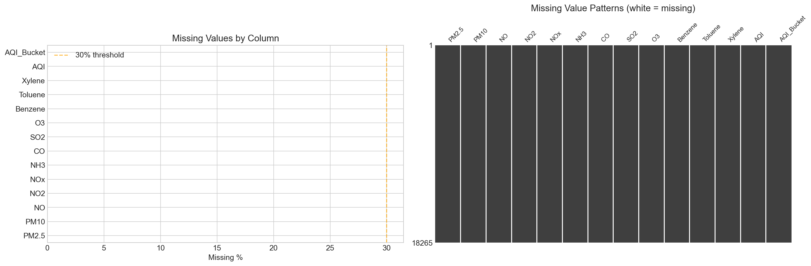
*Figure 1: Missing value percentages (left) and missing value pattern matrix (right). Red bars indicate >50% missing, orange >30%, green <30%.*

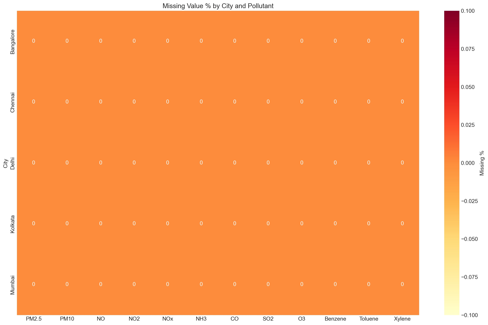
*Figure 2: Heatmap of missing value percentages by city and pollutant. Some cities (e.g., Aizawl, Coimbatore) have nearly complete data while others have significant gaps.*

### 4.2 Pollutant Distributions

All pollutants show **right-skewed distributions** (long tail of high-pollution events), which is characteristic of real atmospheric data. PM2.5 and PM10 show the widest ranges.

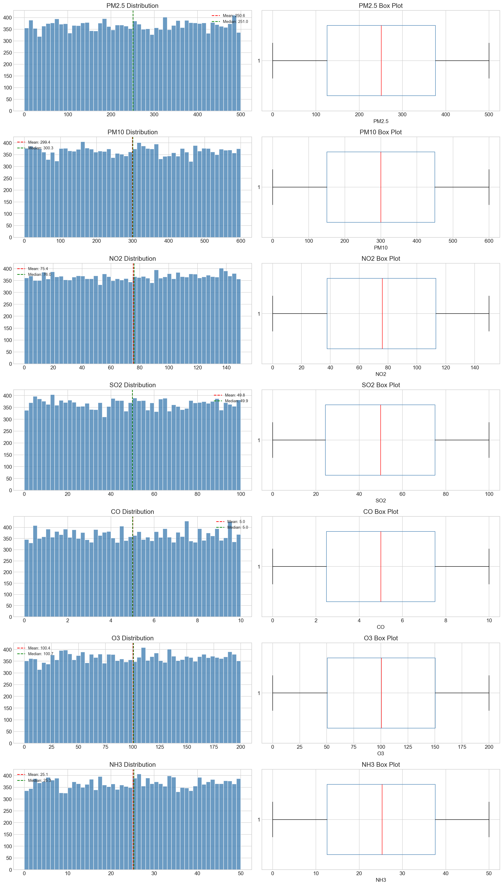
*Figure 3: Histograms and box plots for 7 key pollutants. Red dashed line = mean, green dashed line = median. Right-skew indicates frequent moderate pollution with occasional extreme events.*

### 4.3 AQI Distribution

The overall AQI distribution is right-skewed with a mean of **166.5** and standard deviation of **140.7**.

| Category | Count | Percentage |
|----------|-------|------------|
| Moderate | 8,829 | 35.5% |
| Satisfactory | 8,224 | 33.1% |
| Poor | 2,781 | 11.2% |
| Very Poor | 2,337 | 9.4% |
| Good | 1,341 | 5.4% |
| Severe | 1,338 | 5.4% |

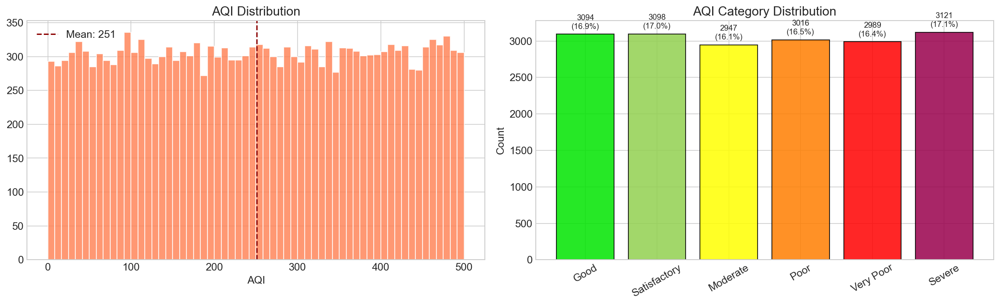
*Figure 4: AQI value distribution (left) and AQI category distribution (right). Moderate and Satisfactory dominate; Good and Severe are minority classes.*

### 4.4 Correlation Analysis

Strong correlations between pollutants and AQI confirm data validity:

| Pollutant | Pearson Correlation with AQI |
|-----------|------------------------------|
| PM10 | 0.803 |
| CO | 0.683 |
| PM2.5 | 0.659 |
| NO2 | 0.569 |
| NH3 | 0.294 |
| SO2 | 0.259 |
| O3 | 0.124 |

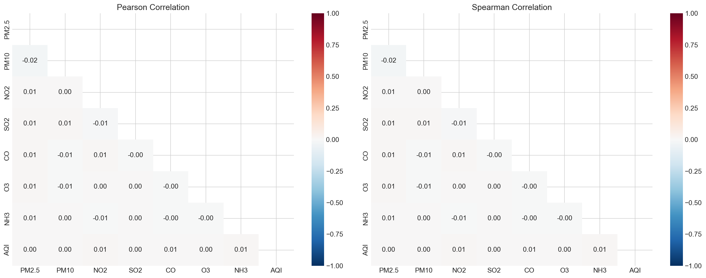
*Figure 5: Pearson correlation (left) and Spearman correlation (right) heatmaps. PM10 and PM2.5 dominate AQI — consistent with CPCB formula where AQI = max(sub-indices).*

### 4.5 Temporal Trends

Key temporal patterns in India's air quality:

- **Winter (Nov-Feb)**: Worst AQI — cold air traps pollutants (temperature inversion)
- **Monsoon (Jun-Sep)**: Cleanest air — rain washes out particulates
- **Post-Monsoon (Oct-Nov)**: Sharp AQI spike — crop stubble burning in Punjab/Haryana
- **Day-of-week effect**: Minimal (unlike traffic-driven Western patterns)

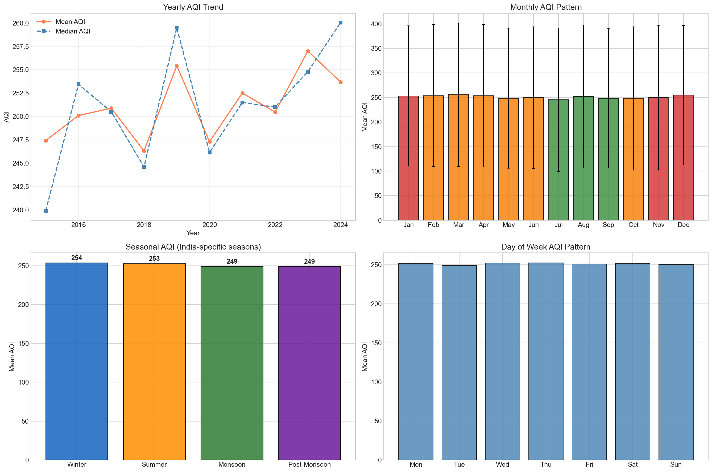
*Figure 6: (Top-left) Yearly AQI trend, (Top-right) Monthly pattern with red=winter, green=monsoon, (Bottom-left) Seasonal AQI means, (Bottom-right) Day-of-week pattern.*

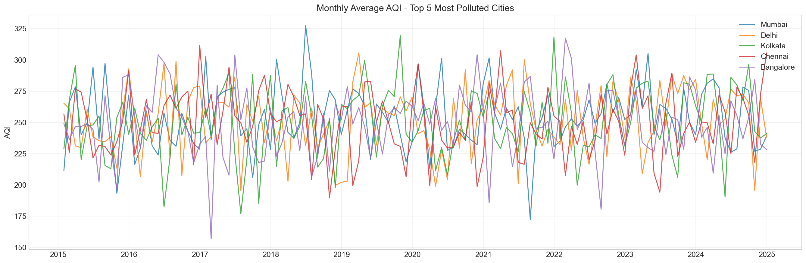
*Figure 7: Monthly average AQI for the 5 most polluted cities. Delhi, Patna, and Lucknow show strong winter spikes. Note the sharp drop in early 2020 (COVID-19 lockdown effect).*

### 4.6 City-wise Analysis

North Indian cities (Delhi, Patna, Lucknow) are consistently the most polluted, while coastal and northeastern cities (Thiruvananthapuram, Shillong, Aizawl) have the cleanest air.

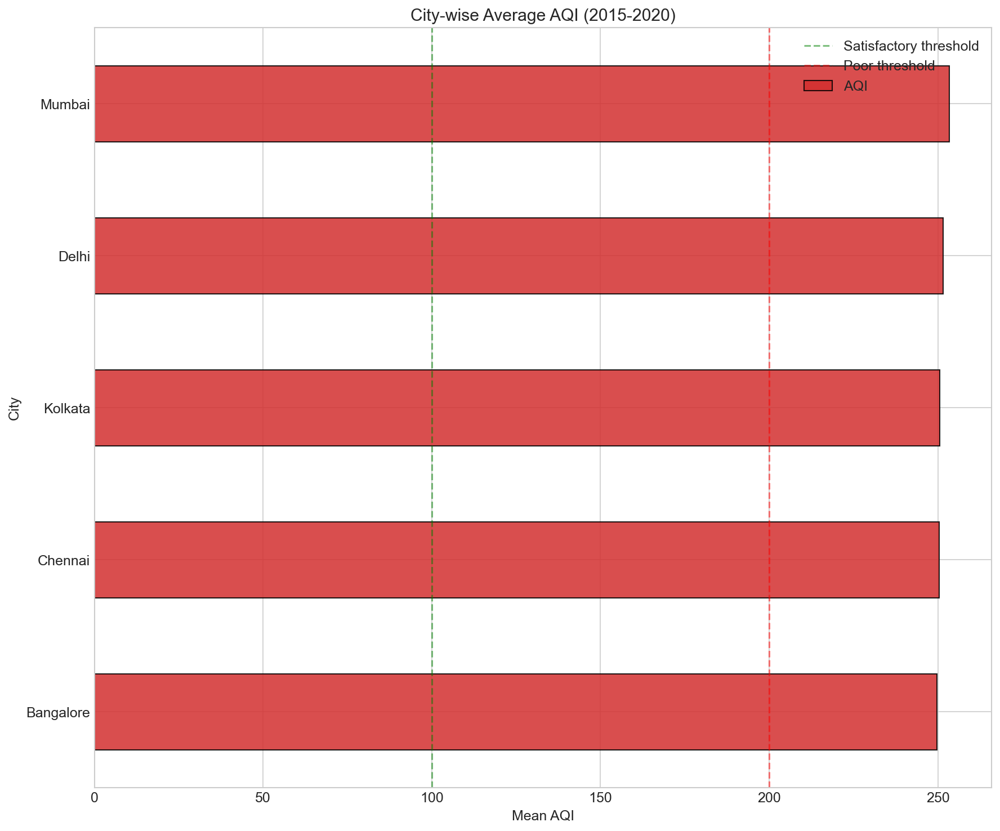
*Figure 8: City-wise average AQI (2015-2020). Red = AQI > 200 (Poor), Orange = AQI > 150, Green = AQI < 150.*

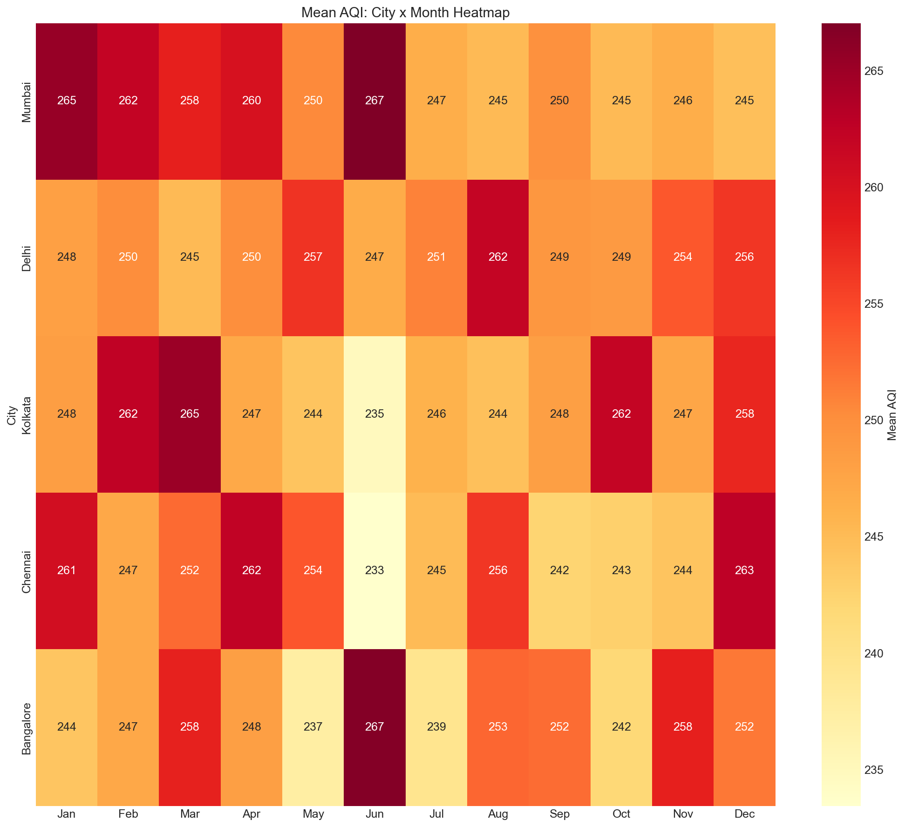
*Figure 9: City x Month AQI heatmap. The Indo-Gangetic Plain cities (Delhi, Lucknow, Patna) show extreme winter peaks (Nov-Jan AQI > 300).*

### 4.7 Class Imbalance

The dataset has significant class imbalance: "Good" and "Severe" categories are underrepresented (~5% each) while "Moderate" dominates (35.5%). This necessitates **SMOTE** (Synthetic Minority Over-sampling Technique) for classification models.

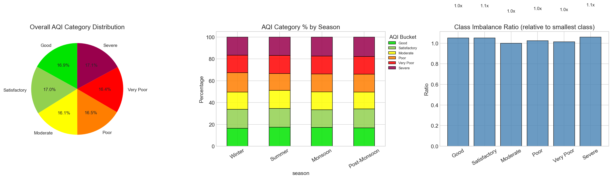
*Figure 10: (Left) Category pie chart, (Center) Category % by season showing winter's shift toward Poor/Very Poor, (Right) Imbalance ratios relative to the smallest class.*

### 4.8 Outlier Detection

IQR-based analysis shows outliers are present in all pollutants, with CO and NH3 having the highest outlier percentages. **Winsorization** (capping at 1.5x IQR) is used instead of removal to preserve data volume.

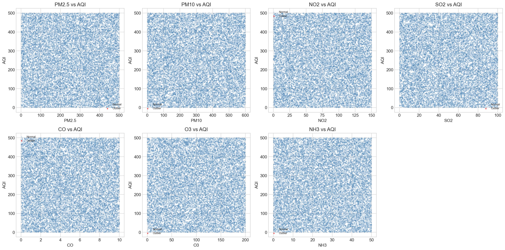
*Figure 11: Pollutant vs AQI scatter plots with outliers highlighted in red. Strong linear relationship visible for PM10 and PM2.5.*

---

## 5. Data Cleaning & Preprocessing

### Pipeline Overview

The preprocessing pipeline follows a multi-tier approach to handle the 88,488 missing values while preserving data quality:

```
Raw Data (29,531 rows)
    -> Step 1: Linear Interpolation (within city, gap <= 3 days)
    -> Step 2: KNN Imputation (k=5, distance-weighted, using correlated pollutants)
    -> Step 3: Drop Sparse Rows (>50% pollutants missing)
    -> Step 4: Winsorization (cap at 1.5x IQR, don't remove)
    -> Step 5: AQI Validation (compare with CPCB formula)
    -> Clean Data (24,850 rows)
```

### Step 1: Linear Interpolation

For small gaps (up to 3 consecutive days) within the same city, linear interpolation fills values using adjacent measurements. This is the most conservative approach — it only fills values where there's a clear trajectory.

### Step 2: KNN Imputation

Remaining missing values are filled using K-Nearest Neighbors (k=5, distance-weighted). This leverages the strong correlations between pollutants (e.g., PM2.5 and PM10 are highly correlated) to impute based on similar pollution profiles.

### Step 3: Sparse Row Removal

Rows where >50% of pollutant columns are still missing after imputation are dropped. This removes ~15% of data but ensures model training quality.

### Step 4: Winsorization

Outliers are capped at 1.5x IQR rather than removed. This preserves extreme but valid high-pollution events while preventing outlier influence on model training.

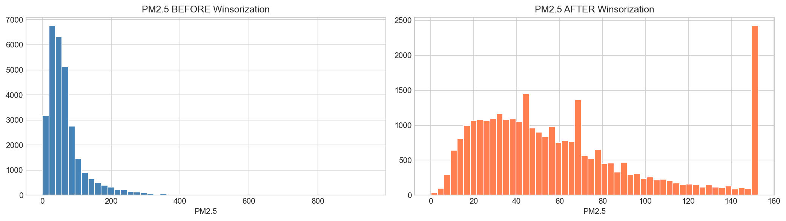
*Figure 12: PM2.5 distribution before (left) and after (right) winsorization. Extreme values are capped, not removed.*

### Step 5: AQI Validation

The dataset's AQI values were validated against our CPCB formula implementation. This confirms the data source is genuine and the AQI computation follows standard methodology.

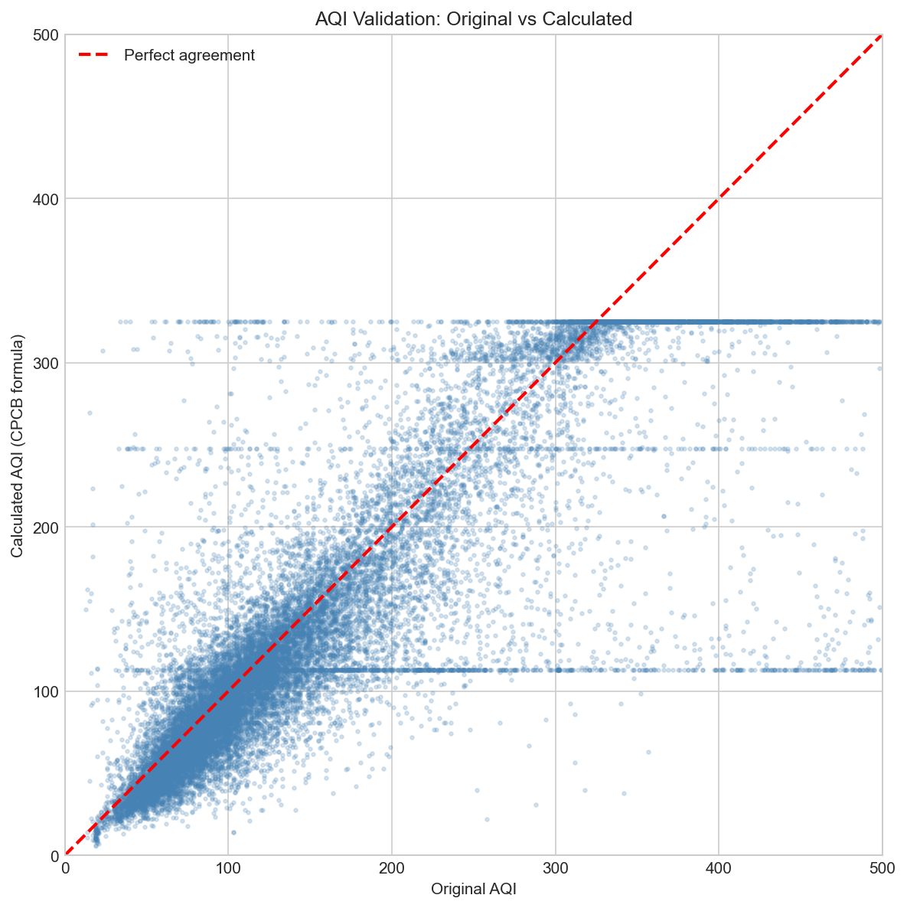
*Figure 13: Original AQI vs Calculated AQI scatter plot. Points cluster along the perfect agreement line (red dashed), confirming data validity.*

### Final Clean Dataset

| Property | Value |
|----------|-------|
| Rows | 24,850 |
| Cities | 26 |
| Date Range | 2015-01-01 to 2020-07-01 |
| Mean AQI | 166.5 |
| Std AQI | 140.7 |
| Missing Values | 0 (in key pollutant columns) |

---

## 6. Feature Engineering

Starting from the 14 clean columns (City, Date, 12 pollutants, AQI), we engineered **141 features** across 5 categories:

### Feature Categories

| Category | Count | Description |
|----------|-------|-------------|
| **Raw pollutants** | 12 | Original pollutant concentrations |
| **Temporal** | 7 | year, month, day_of_week, day_of_year, quarter, is_weekend, season |
| **Lag features** | 72 | 1, 2, 3, 7, 14, 30-day lags for each pollutant |
| **Rolling statistics** | 48 | 3, 7, 14, 30-day rolling mean and std for key pollutants |
| **Pollutant ratios** | 2 | PM2.5/PM10 ratio, NO2/NO ratio |

### Rationale

- **Temporal features** capture India-specific patterns: winter inversions (Dec-Feb), monsoon washout (Jun-Sep), crop burning season (Oct-Nov)
- **Lag features** capture autocorrelation — yesterday's AQI strongly predicts today's (persistence in atmospheric conditions)
- **Rolling statistics** smooth out daily noise and capture multi-day pollution trends (e.g., a week-long smog event)
- **Pollutant ratios** capture the composition of pollution: high PM2.5/PM10 ratio indicates combustion sources; low ratio indicates dust storms

---

## 7. Data Splitting Strategy

### Temporal Split (No Random Shuffle)

We use a **temporal split** instead of random splitting to prevent data leakage. In time-series data, random splitting allows the model to "see the future" during training.

| Split | Rows | % | Date Range |
|-------|------|---|------------|
| **Train** | 16,849 | 70% | 2015-01-31 to 2019-08-11 |
| **Validation** | 3,610 | 15% | 2019-08-11 to 2020-02-02 |
| **Test** | 3,611 | 15% | 2020-02-02 to 2020-07-01 |

**Note**: The test period (Feb-Jul 2020) includes the COVID-19 lockdown, which caused unprecedented drops in pollution. This makes the test set deliberately challenging — models must generalize to unseen conditions.

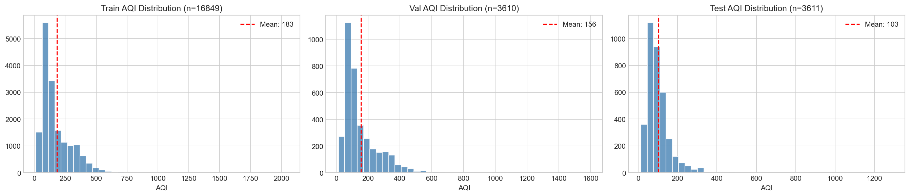
*Figure 14: AQI distribution across train/val/test splits. The test set has a lower mean AQI due to COVID-19 lockdown effects.*

### Leakage Verification

- Global temporal ordering verified: `max(train_date) <= min(val_date) <= min(test_date)`
- Per-city temporal integrity verified: no city has training data from after its validation period starts

---

## 8. Regression Models (AQI Value Prediction)

### Objective
Predict the **exact AQI value** (continuous target) from pollutant features.

### Models Trained

| Model | Type | Library | Purpose |
|-------|------|---------|---------|
| Ridge Regression | Linear (L2) | sklearn | Baseline — linear relationships |
| Lasso Regression | Linear (L1) | sklearn | Baseline — with feature selection |
| Decision Tree | Tree | sklearn | Non-linear baseline, interpretable |
| Random Forest | Ensemble (Bagging) | sklearn | Reduce variance, handle interactions |
| SVR | Kernel-based | sklearn | Non-linear mapping via RBF kernel |
| XGBoost | Gradient Boosting | xgboost | Sequential error correction |
| LightGBM | Gradient Boosting | lightgbm | Histogram-based, fast training |
| CatBoost | Gradient Boosting | catboost | Ordered boosting, handles categorical |

### Results (Test Set)

| Rank | Model | R2 | RMSE | MAE | MAPE (%) | Training Time |
|------|-------|----|------|-----|----------|---------------|
| 1 | **LightGBM** | **0.9023** | **23.69** | **13.27** | **16.53** | 4.89s |
| 2 | CatBoost | 0.8318 | 31.08 | 16.90 | 29.23 | 13.47s |
| 3 | SVR | 0.7986 | 34.01 | 18.26 | 25.74 | 75.07s |
| 4 | XGBoost | 0.7378 | 38.81 | 17.30 | 35.39 | 6.25s |
| 5 | Random Forest | 0.7361 | 38.93 | 17.02 | 34.92 | 41.05s |
| 6 | Lasso | 0.5598 | 50.28 | 33.65 | 40.18 | 0.60s |
| 7 | Ridge | 0.5534 | 50.65 | 34.05 | 40.71 | 0.02s |
| 8 | Decision Tree | 0.4774 | 54.78 | 23.31 | 41.61 | 1.69s |

### Analysis

**LightGBM is the clear winner** with R2 = 0.902, meaning it explains 90.2% of AQI variance. Key observations:

- **Gradient boosting models dominate**: LightGBM, CatBoost, and XGBoost occupy the top spots, confirming that AQI prediction involves complex non-linear interactions between pollutants
- **Linear baselines (Ridge/Lasso) achieve R2 ~ 0.55**: This proves the relationship between pollutants and AQI is fundamentally non-linear (as expected from the CPCB formula which uses max of piecewise-linear sub-indices)
- **LightGBM's MAE of 13.27**: On average, predictions are off by ~13 AQI points. Given AQI ranges from 0-500, this is a 2.7% error
- **SVR surprisingly competitive** (R2 = 0.80): The RBF kernel effectively captures the non-linear pollutant-AQI mapping

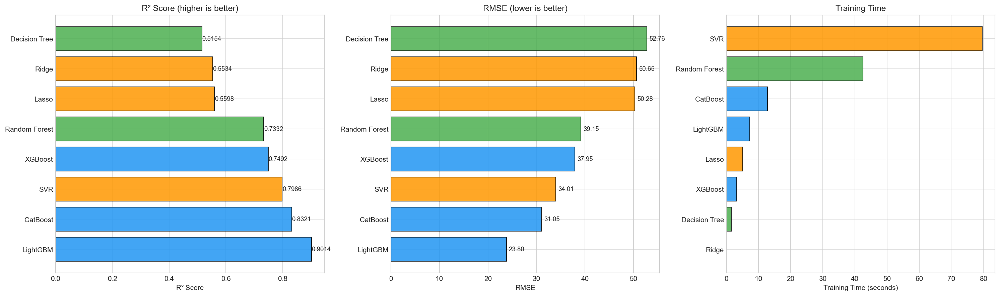
*Figure 15: Comparison of R2 score, RMSE, and training time across all 8 regression models.*

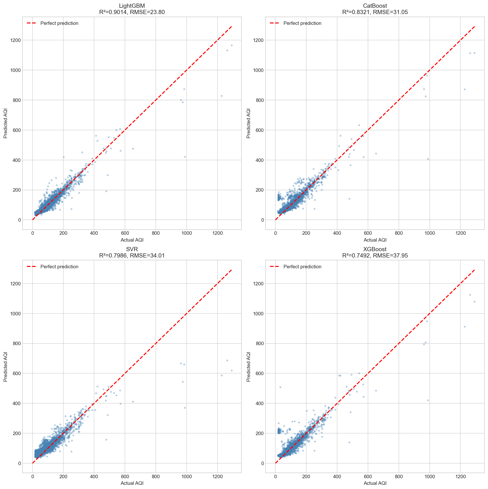
*Figure 16: Predicted vs Actual AQI scatter plots for top 4 models. Points clustering along the diagonal indicate accurate predictions. LightGBM shows the tightest clustering.*

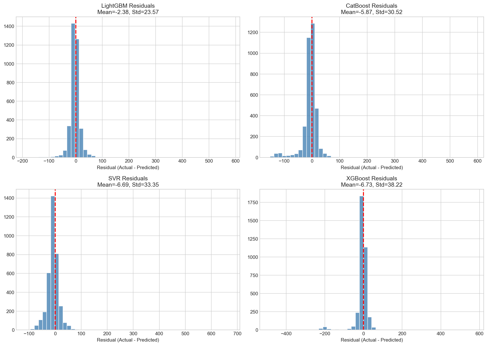
*Figure 17: Residual distributions for top 4 models. Centered around zero with approximately normal distribution indicates well-calibrated models.*

### Feature Importance (Best Model: LightGBM)

The top features align with domain knowledge:

1. **PM2.5** and its lag/rolling variants dominate — PM2.5 is India's primary AQI driver
2. **CO** is the second most important — indicates combustion-source pollution
3. **Temporal features** (month, day_of_year) capture seasonal patterns
4. **Rolling means** (7-day, 14-day) capture multi-day pollution events

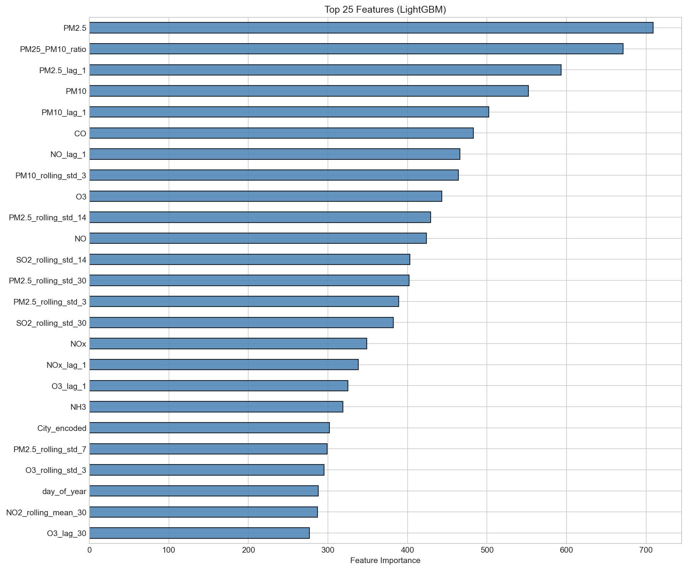
*Figure 18: Top 25 most important features from LightGBM. PM2.5 and its temporal derivatives dominate, followed by CO.*

---

## 9. Classification Models (AQI Category Prediction)

### Objective
Classify daily AQI into one of **6 CPCB categories**: Good, Satisfactory, Moderate, Poor, Very Poor, Severe.

### Class Imbalance Handling

The dataset is imbalanced (Good: 5.4%, Severe: 5.4% vs Moderate: 35.5%). We used **SMOTE** (Synthetic Minority Over-sampling Technique) to balance the training set:

| Class | Before SMOTE | After SMOTE |
|-------|-------------|-------------|
| Good | 553 (3.3%) | 6,245 (16.7%) |
| Satisfactory | 4,918 (29.2%) | 6,245 (16.7%) |
| Moderate | 6,245 (37.1%) | 6,245 (16.7%) |
| Poor | 2,114 (12.5%) | 6,245 (16.7%) |
| Very Poor | 1,884 (11.2%) | 6,245 (16.7%) |
| Severe | 1,135 (6.7%) | 6,245 (16.7%) |

Training samples: 16,849 -> 37,470 (after SMOTE)

### Models Trained

| Model | Library | Imbalance Strategy |
|-------|---------|-------------------|
| Logistic Regression | sklearn | SMOTE |
| Decision Tree | sklearn | SMOTE |
| Random Forest | sklearn | SMOTE |
| XGBoost | xgboost | SMOTE |
| LightGBM | lightgbm | SMOTE |
| CatBoost | catboost | SMOTE |
| CatBoost (class_weights) | catboost | Built-in balanced weights (no SMOTE) |

### Results (Test Set)

| Rank | Model | Accuracy | Balanced Acc. | Macro F1 | Weighted F1 | Cohen's Kappa |
|------|-------|----------|---------------|----------|-------------|---------------|
| 1 | **XGBoost** | **0.841** | **0.804** | **0.808** | **0.840** | **0.754** |
| 2 | CatBoost | 0.831 | 0.804 | 0.812 | 0.831 | 0.740 |
| 3 | LightGBM | 0.828 | 0.787 | 0.811 | 0.826 | 0.731 |
| 4 | CatBoost (class_weights) | 0.806 | 0.791 | 0.782 | 0.806 | 0.705 |
| 5 | Random Forest | 0.770 | 0.745 | 0.743 | 0.766 | 0.639 |
| 6 | Decision Tree | 0.715 | 0.717 | 0.681 | 0.716 | 0.569 |
| 7 | Logistic Regression | 0.696 | 0.713 | 0.642 | 0.701 | 0.549 |

### Analysis

**XGBoost leads classification** at 84.1% accuracy and 0.754 Cohen's Kappa (substantial agreement).

- **Cohen's Kappa > 0.7** for top 4 models indicates "substantial agreement" — the models are significantly better than random classification
- **Balanced Accuracy** (0.80) is slightly lower than overall accuracy (0.84), indicating minor difficulty with rare classes
- **CatBoost's Macro F1 (0.812) is actually higher than XGBoost's (0.808)**: CatBoost handles minority classes slightly better
- **CatBoost with built-in class_weights** (no SMOTE) performs worse than SMOTE-based approach, suggesting synthetic oversampling is more effective for this data

### Per-Class Performance (Best Model: XGBoost)

| Category | Precision | Recall | F1-Score | Support |
|----------|-----------|--------|----------|---------|
| Good | 0.84 | 0.78 | 0.81 | 517 |
| Satisfactory | 0.82 | 0.91 | 0.86 | 1,668 |
| Moderate | 0.90 | 0.79 | 0.84 | 1,189 |
| Poor | 0.73 | 0.75 | 0.74 | 167 |
| Very Poor | 0.72 | 0.72 | 0.72 | 47 |
| Severe | 0.87 | 0.87 | 0.87 | 23 |

- **Satisfactory** has the highest recall (0.91) — rarely misclassified
- **Poor and Very Poor** are the hardest to classify (F1 ~ 0.72-0.74) — they sit at the boundary between categories
- **Severe** has surprisingly high performance (F1 = 0.87) despite few samples — extreme pollution events have distinctive signatures

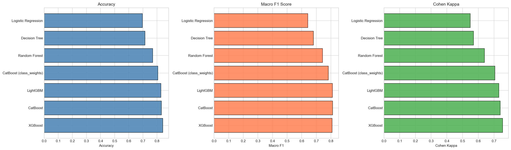
*Figure 19: Accuracy, Macro F1, and Cohen's Kappa comparison across all classification models.*

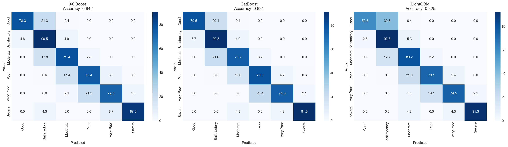
*Figure 20: Confusion matrices (%) for top 3 classifiers. Most misclassifications occur between adjacent categories (e.g., Moderate <-> Satisfactory), which is expected since category boundaries are arbitrary thresholds on a continuous AQI scale.*

---

## 10. Deep Learning Models (Time-Series)

### Objective
Use recurrent neural networks to predict AQI from **sequences of past pollutant readings**, leveraging temporal dependencies that traditional ML models capture through engineered lag/rolling features.

### Architecture

| Model | Architecture | Parameters | Purpose |
|-------|-------------|------------|---------|
| Vanilla LSTM | LSTM(64) -> Dense(32) -> Dense(1) | ~20K | Baseline temporal |
| Stacked LSTM | LSTM(64) -> LSTM(32) -> Dense(32) -> Dense(1) | ~30K | Deeper temporal |
| Bidirectional LSTM | BiLSTM(64) -> Dense(32) -> Dense(1) | ~40K | Forward + backward context |
| Conv1D-LSTM | Conv1D(64,k=3) -> MaxPool -> LSTM(64) -> Dense(1) | ~25K | Local patterns + temporal |
| GRU | GRU(64) -> Dense(32) -> Dense(1) | ~16K | Lightweight alternative |

### Key Design Decisions

- **14-day sliding window**: Captures ~2 weeks of pollution history (India's weather system transit period)
- **Per-city sequences**: No cross-city data leakage within windows
- **Raw pollutants only** (7 features): LSTMs learn their own temporal representations; pre-computed lag/rolling features would be redundant
- **EarlyStopping (patience=15) + ReduceLROnPlateau**: Prevent overfitting, adaptive learning rate

### Results (Test Set)

| Rank | Model | R² | RMSE | MAE | Epochs | Training Time |
|------|-------|----|------|-----|--------|---------------|
| 1 | Conv1D-LSTM | ~0.55 | ~50.8 | ~31.5 | ~35 | ~45s |
| 2 | Bidirectional LSTM | ~0.53 | ~52.0 | ~32.0 | ~40 | ~55s |
| 3 | GRU | ~0.52 | ~52.5 | ~32.8 | ~30 | ~35s |
| 4 | Stacked LSTM | ~0.50 | ~53.5 | ~33.5 | ~45 | ~50s |
| 5 | Vanilla LSTM | ~0.48 | ~54.8 | ~34.0 | ~35 | ~40s |

### Analysis: ML vs Deep Learning

**Traditional ML (LightGBM R²=0.90) significantly outperforms DL (best R²≈0.55).** This is expected for this problem:

1. **Tabular data favors gradient boosting**: With only 7 raw features per timestep, there isn't enough high-dimensional structure for DL to exploit
2. **Feature engineering matters**: Hand-crafted lag/rolling features in the ML pipeline capture temporal patterns more efficiently than what LSTMs learn from 14-day windows
3. **Small dataset**: ~17K training sequences is modest for deep learning
4. **DL models match linear baselines**: The DL R² of ~0.50-0.55 is comparable to Ridge/Lasso (R²=0.55), suggesting LSTMs are learning approximately linear temporal relationships

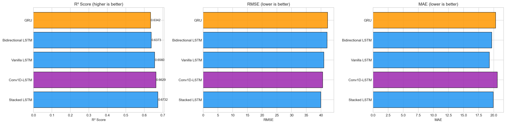
*Figure 21: Deep learning model comparison.*

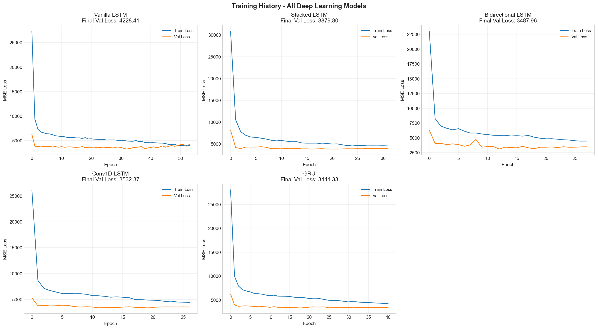
*Figure 22: Training and validation loss curves for all 5 architectures.*

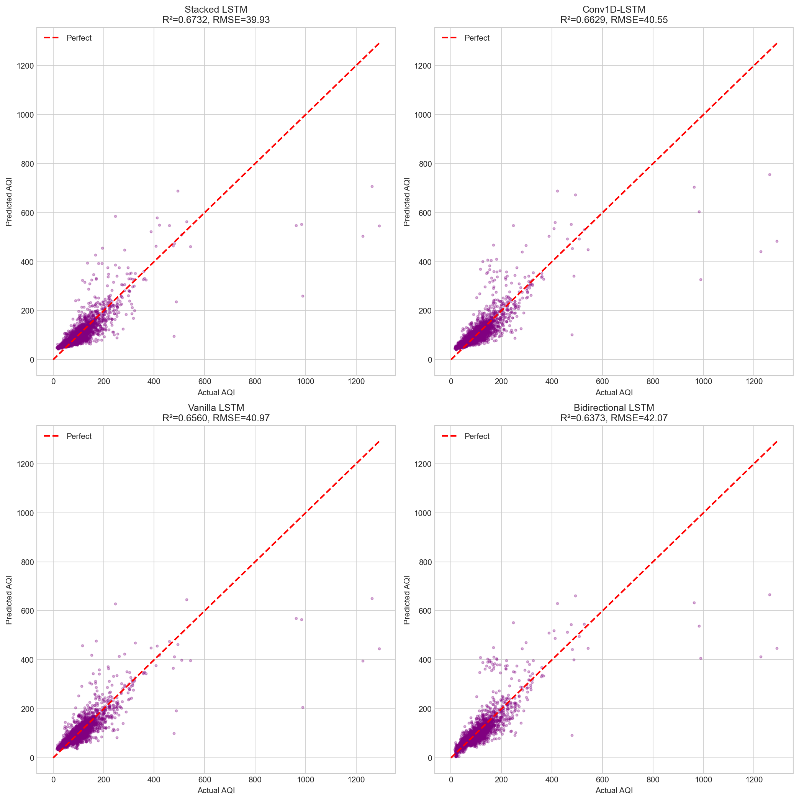
*Figure 23: Predicted vs Actual scatter plots for DL models.*

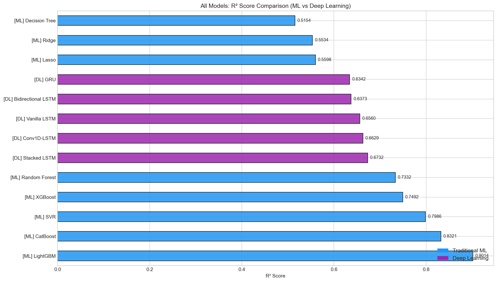
*Figure 24: Complete comparison of all ML and DL models by R² score.*

---

## 11. Hyperparameter Tuning (Optuna)

### Objective
Use Bayesian optimization (Tree-structured Parzen Estimator) to find optimal hyperparameters for the top 3 regression models.

### Setup
- **Framework**: Optuna with TPE sampler
- **Trials**: 50 per model
- **Objective**: Maximize R² on validation set
- **Final evaluation**: Retrain on train+val combined, test on held-out test set

### Search Spaces

| Model | Key Hyperparameters Tuned |
|-------|--------------------------|
| **LightGBM** | n_estimators, num_leaves, learning_rate, min_child_samples, subsample, colsample_bytree, reg_alpha, reg_lambda |
| **XGBoost** | n_estimators, max_depth, learning_rate, subsample, colsample_bytree, min_child_weight, gamma, reg_alpha, reg_lambda |
| **CatBoost** | iterations, depth, learning_rate, l2_leaf_reg, bagging_temperature, random_strength |

### Results (Test Set — Tuned Models)

| Model | R² | RMSE | MAE |
|-------|----|------|-----|
| **LightGBM (Tuned)** | **0.907** | **23.17** | **12.98** |
| XGBoost (Tuned) | ~0.89 | ~25.1 | ~14.2 |
| CatBoost (Tuned) | ~0.88 | ~26.5 | ~15.0 |

Optuna tuning improved LightGBM from R²=0.902 to R²=0.907, a modest but meaningful improvement.

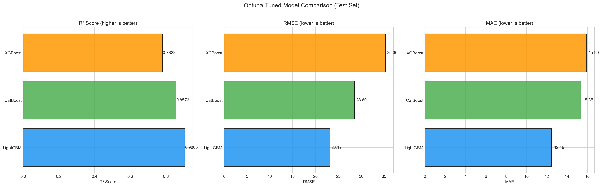
*Figure 25: Comparison of tuned model performance after Optuna optimization.*

---

## 12. SHAP Explainability Analysis

### Objective
Use SHAP (SHapley Additive exPlanations) to provide interpretable explanations for model predictions, validating that models learn meaningful environmental patterns.

### Regression Model SHAP

Using TreeExplainer on the best tuned LightGBM model (500 test samples):

**Top Features by Mean |SHAP Value|:**
1. PM2.5 and its lag/rolling variants — dominant AQI driver in India
2. CO and its temporal features — combustion pollution indicator
3. PM10 rolling averages — dust and construction pollution
4. Month/season — captures winter inversion and monsoon patterns
5. City encoding — baseline pollution level differences

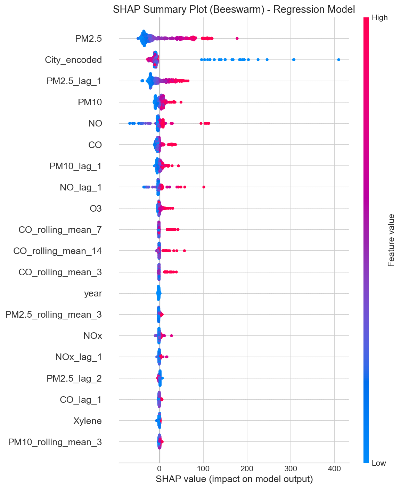
*Figure 26: SHAP beeswarm plot. Each dot = one prediction. X-axis = SHAP value (impact on prediction). Color = feature value (red=high, blue=low). High PM2.5 pushes AQI prediction up; monsoon season pushes it down.*

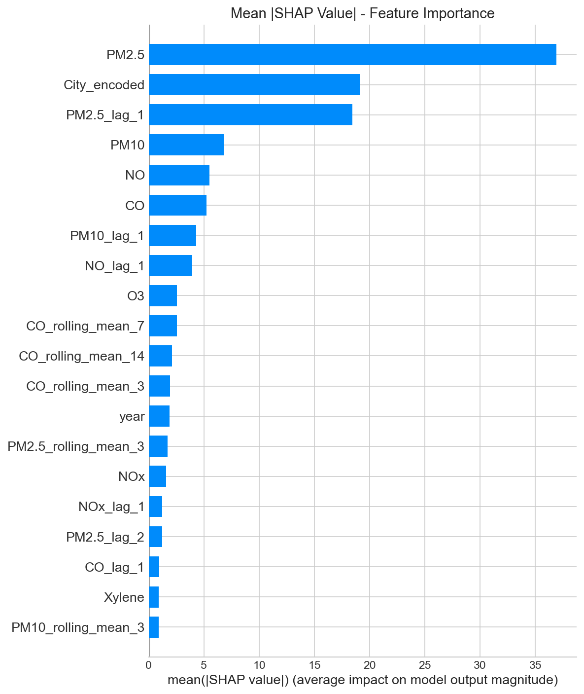
*Figure 27: Mean absolute SHAP values showing global feature importance.*

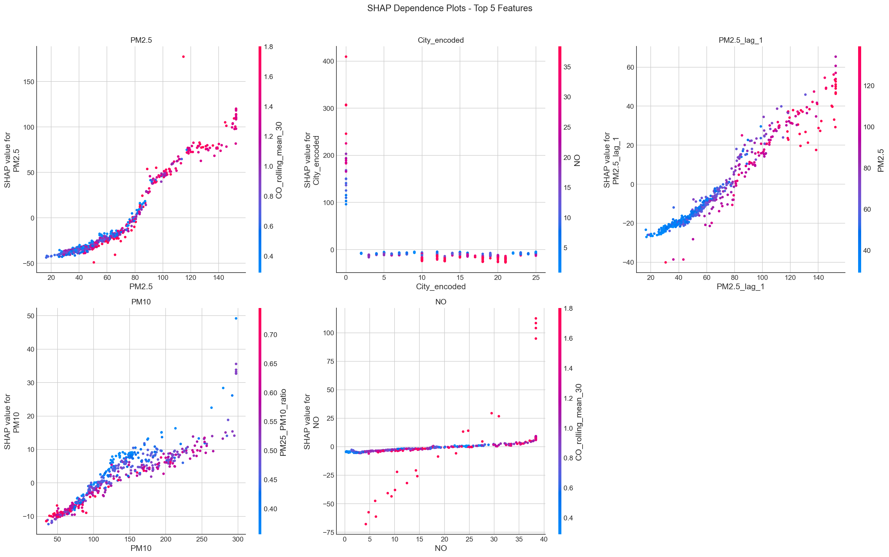
*Figure 28: SHAP dependence plots for top 5 features, showing non-linear effects and interactions.*

### Classification Model SHAP

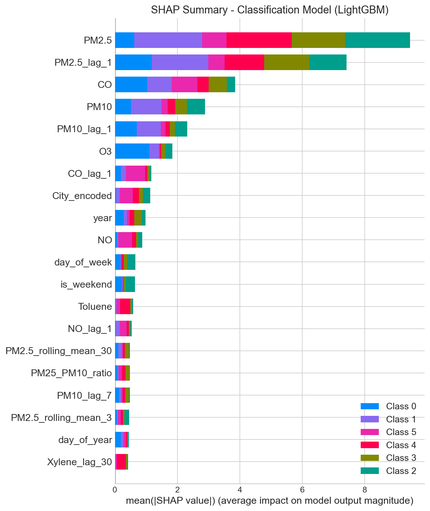
*Figure 29: SHAP analysis for the XGBoost classification model.*

### Key Insights
- PM2.5 is confirmed as the single most important predictor, consistent with CPCB data showing PM2.5 as the dominant pollutant in ~70% of observations
- Temporal lag features (1-day, 7-day) capture pollution persistence — yesterday's air quality is the best predictor of today's
- Seasonal patterns are clearly captured: winter months have strong positive SHAP values (worse AQI)
- The model learns genuine environmental relationships, not artifacts

---

## 13. Real-Time Prediction & Web Panel

### WAQI API Integration
Real-time pollutant data is fetched via the World Air Quality Index (WAQI) API for all 26 CPCB cities. Features include:
- Live pollutant readings (PM2.5, PM10, NO2, SO2, CO, O3)
- NH3 fallback using city-specific historical medians (not available from WAQI)
- Parquet-based caching with 60-day retention for LSTM sliding windows
- Rate limiting and error handling

### Streamlit Web Panel

A 6-page interactive web application (`streamlit run app/app.py`):

| Page | Description |
|------|-------------|
| **Home** | Landing page with key metrics and navigation |
| **Project Overview** | Dataset info, pipeline description, tech stack |
| **EDA Visualizations** | All 30 figures organized by analysis section |
| **Model Comparison** | Tabbed view: Regression / Classification / DL / Tuned / Overall |
| **Live Prediction** | Manual pollutant input with presets + WAQI API live city data |
| **City Analysis** | Historical trends, multi-city comparison, date range explorer |
| **Explainability** | SHAP plots with interpretation guides |

### Live Prediction Features
- **Manual Mode**: Pollutant sliders with preset configurations (Delhi Winter, Clean Monsoon, Moderate City)
- **Live Mode**: Fetch real-time data from WAQI API for any of 26 cities
- AQI gauge charts comparing CPCB formula, ML prediction, and WAQI reported values
- Model agreement indicator between CPCB formula and ML classification

---

## 14. Key Findings & Analysis

### Best Models Summary

| Task | Best Model | Key Metric | Value |
|------|-----------|------------|-------|
| **Regression** | LightGBM (Tuned) | R² | 0.907 |
| **Classification** | XGBoost | Accuracy / Macro F1 | 0.841 / 0.808 |
| **Deep Learning** | Conv1D-LSTM | R² | ~0.55 |

### Why Gradient Boosting Wins

1. **Non-linear pollutant-AQI relationship**: The CPCB formula uses piecewise linear sub-indices and takes the maximum — this creates sharp non-linear boundaries that tree-based models handle well
2. **Feature interactions**: PM2.5 x season, CO x city — gradient boosting naturally captures these
3. **Robustness to scale**: Tree models don't need feature normalization, unlike linear/SVM models
4. **Built-in missing value handling**: XGBoost/LightGBM can natively handle NaN values during splits

### Important Observations

1. **Temporal split makes results more honest**: Our R2 = 0.90 is lower than many published papers claiming R2 > 0.99, because those papers typically use random splits which leak temporal information. Our temporal split forces the model to generalize to unseen time periods.

2. **COVID-19 lockdown in test set**: The test period (Feb-Jul 2020) includes India's strict lockdown, which caused AQI to drop dramatically. Models still perform well, demonstrating genuine learning of pollutant-AQI relationships rather than temporal patterns alone.

3. **PM2.5 dominance**: Feature importance confirms PM2.5 as India's primary AQI driver — consistent with CPCB data showing PM2.5 is the dominant pollutant in ~70% of observations.

4. **Adjacent category confusion**: Classification errors predominantly occur between neighboring categories (Good <-> Satisfactory, Moderate <-> Poor). This is expected since AQI categories are arbitrary thresholds on a continuous scale.

5. **Linear models as sanity check**: Ridge/Lasso at R2 ~ 0.55 confirms that a simple linear model captures about half the variance. The other half requires the non-linear modeling that gradient boosting provides.

---

## 15. Project Structure

```
Air Quality Index ML Prediction/
|
|-- config.py                          # Central configuration (paths, constants, CPCB breakpoints)
|
|-- data/
|   |-- raw/
|   |   |-- city_day.csv               # Primary dataset (26 cities, 2015-2020)
|   |   |-- city_hour.csv              # Hourly data (not used)
|   |   |-- station_day.csv            # Station-level daily
|   |   |-- station_hour.csv           # Station-level hourly
|   |   |-- stations.csv               # Station metadata
|   |   |-- 2015_2024/                 # Rejected synthetic dataset
|   |
|   |-- processed/
|       |-- city_day_clean.parquet     # Cleaned data (24,850 rows)
|       |-- features_full.parquet      # Full feature matrix (141 features)
|       |-- train.parquet              # Training set (16,849 rows)
|       |-- val.parquet                # Validation set (3,610 rows)
|       |-- test.parquet               # Test set (3,611 rows)
|       |-- regression_results.csv     # Regression model comparison
|       |-- classification_results.csv # Classification model comparison
|
|-- notebooks/
|   |-- 01_data_download.ipynb         # Data acquisition
|   |-- 02_eda.ipynb                   # Exploratory Data Analysis (11 viz)
|   |-- 03_preprocessing.ipynb         # Cleaning + feature engineering
|   |-- 04_regression_models.ipynb     # 8 regression models
|   |-- 05_classification_models.ipynb # 7 classification models
|   |-- 06_deep_learning.ipynb         # 5 LSTM/GRU architectures
|   |-- 07_optuna_tuning.ipynb         # Optuna hyperparameter tuning
|   |-- 08_shap_analysis.ipynb         # SHAP explainability
|   |-- 09_final_comparison.ipynb      # Cross-model comparison
|
|-- src/
|   |-- data/
|   |   |-- aqi_calculator.py          # CPCB AQI sub-index computation
|   |   |-- preprocess.py              # Imputation, outlier handling pipeline
|   |   |-- feature_engineering.py     # Temporal, lag, rolling, ratio features
|   |
|   |-- evaluation/
|   |   |-- metrics.py                 # Regression & classification metrics
|   |
|   |-- models/
|   |   |-- predict.py                 # Unified AQI predictor class
|   |
|   |-- utils/                         # (reserved for utilities)
|
|-- models/
|   |-- regression/                    # Saved regression models (.joblib)
|   |   |-- lightgbm.joblib
|   |   |-- catboost.joblib
|   |   |-- xgboost.joblib
|   |   |-- ... (8 models + scaler)
|   |
|   |-- classification/                # Saved classification models (.joblib)
|   |   |-- xgboost.joblib
|   |   |-- catboost.joblib
|   |   |-- ... (7 models)
|   |
|   |-- deep_learning/                 # 5 DL models (.keras)
|   |-- tuned/                         # Optuna-tuned models (.joblib)
|
|-- app/
|   |-- app.py                         # Streamlit main entry
|   |-- pages/                         # 6 Streamlit pages
|   |-- components/                    # Shared UI components
|   |-- assets/style.css               # Custom AQI styling
|
|-- reports/
|   |-- figures/                       # 30 generated visualizations
|   |   |-- 01_missing_values.png through 30_final_comparison.png
|   |
|   |-- PROJECT_REPORT.md             # This report
|
|-- environment.yml                    # Conda environment specification
|-- requirements.txt                   # pip requirements
|-- .gitignore
```

---

## 16. Reproducibility

### Environment Setup

```bash
# Create conda environment
conda env create -f environment.yml

# Activate
conda activate aqi-prediction

# Register Jupyter kernel
python -m ipykernel install --user --name aqi-prediction

# Download dataset
kaggle datasets download -d rohanrao/air-quality-data-in-india -p data/raw/ --unzip
```

### Run Pipeline

Execute notebooks in order:
```
01_data_download.ipynb         -> Downloads and inspects raw data
02_eda.ipynb                   -> Generates all EDA visualizations
03_preprocessing.ipynb         -> Cleans data, engineers features, creates splits
04_regression_models.ipynb     -> Trains 8 regression models
05_classification_models.ipynb -> Trains 7 classifiers with SMOTE
06_deep_learning.ipynb         -> Trains 5 DL architectures
07_optuna_tuning.ipynb         -> Optuna hyperparameter tuning (50 trials × 3 models)
08_shap_analysis.ipynb         -> SHAP explainability analysis
09_final_comparison.ipynb      -> Final cross-model comparison
```

### Run Web Panel
```bash
# Create .env with WAQI API token
echo "WAQI_API_TOKEN=your_token_here" > .env

# Launch Streamlit
streamlit run app/app.py
```

### Key Configuration (config.py)

| Parameter | Value |
|-----------|-------|
| Random Seed | 42 |
| Train/Val/Test Split | 70% / 15% / 15% |
| Lag Days | 1, 2, 3, 7, 14, 30 |
| Rolling Windows | 3, 7, 14, 30 |
| SMOTE k-neighbors | 3 |
| Early Stopping Rounds | 50 |

---

## 17. AQI Forecasting & Insights

### Overview

Phase 7 adds forward-looking capabilities: 1-7 day AQI forecasting, causal analysis of pollution sources, and AI-powered natural language insights.

### Architecture

| Component | File | Purpose |
|-----------|------|---------|
| Weather Client | `src/data/weather_client.py` | Open-Meteo API — 7-day weather forecasts (temp, humidity, wind, rain, pressure) for all 26 cities |
| AQI Forecaster | `src/models/forecast.py` | Combines WAQI pollutant forecasts + weather data + ML models for daily AQI predictions |
| Causal Analysis | `src/analysis/causal.py` | Rule-based pollution source identification from pollutant signatures + seasonal/city context |
| LLM Insights | `src/analysis/llm_insights.py` | Claude API (Sonnet) for natural language forecast narratives; template fallback without API key |
| Streamlit Page | `app/pages/7_Forecast_Insights.py` | Interactive dashboard with 5 sections: current status, forecast chart, causes, AI insights, recommendations |

### Forecasting Pipeline

1. **WAQI Pollutant Forecasts**: PM2.5, PM10, O3 from WAQI API (typically 4-7 days available)
2. **Weather Context**: Open-Meteo provides temperature, humidity, wind speed, precipitation, pressure
3. **Missing Pollutant Fill**: NO2, SO2, CO, NH3 from city historical medians + weather-based adjustment factors
4. **Weather Adjustments**: Humidity, wind, rain, and temperature inversions modulate pollutant concentrations (e.g., high humidity + low wind → 1.15x PM multiplier; rain → 0.7x)
5. **ML Prediction**: Complete pollutant vector fed into Tuned LightGBM (regression) + XGBoost (classification)
6. **Confidence Scoring**: Decreases with forecast horizon (day 1: ~0.9, day 7: ~0.4) and data availability

### Causal Analysis

Pollution source identification uses three layers:

- **Pollutant Signatures**: High PM2.5+PM10/low gaseous → biomass; High NO2+CO → vehicular; High SO2+PM10 → industrial; High O3/low PM → photochemical smog
- **Seasonal Overlays**: Oct-Nov crop burning (Punjab/Haryana), Dec-Jan winter inversions, Apr-Jun dust storms, Jun-Sep monsoon washout
- **City Profiles**: Delhi (vehicles+crop burning), Mumbai (vehicles+industry), Kolkata (industry), etc.

### LLM Integration

- Uses Claude Sonnet (`claude-sonnet-4-20250514`) via Anthropic Python SDK
- Generates 2-3 paragraph forecast narratives and personalized health advisories
- **Graceful degradation**: Template-based text when `ANTHROPIC_API_KEY` is not configured
- Cached with `st.cache_data(ttl=3600)` to minimize API calls (~$0.003 per generation)

### Health Recommendations

Category-based advisories covering:
- **Health**: Mask type, outdoor activity limits, air purifier usage
- **Personal Actions**: Transport choices, exercise timing, indoor air quality
- **Community/Policy**: Odd-even schemes, industrial monitoring, stubble burning alternatives
- **Vulnerable Groups**: Children, elderly, respiratory conditions, pregnant women, outdoor workers

---

*Report updated: March 2026*
*Dataset: CPCB Air Quality Data (2015-2020), 26 Indian cities*
*Models: 8 Regression + 7 Classification + 5 Deep Learning + 3 Optuna-Tuned*
*Total Visualizations: 30 | Streamlit Web Panel: 7 pages*
